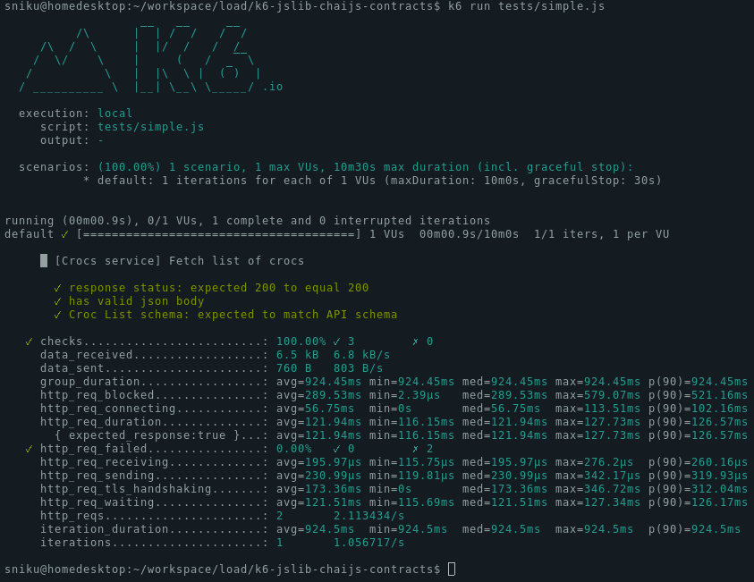

# API contract validation plugin for k6Chaijs Assertion Library

Installation docs: http://k6.io/docs/javascript-api/jslib/chaijs

API docs: https://www.chaijs.com/api/bdd/ 

Download from: https://jslib.k6.io/

```js
import http from 'k6/http';
import { describe, expect, chai } from 'https://jslib.k6.io/k6chaijs/4.3.4.0/index.js';
import { initContractPlugin } from 'https://jslib.k6.io/k6chaijs-contracts/4.3.4.0/index.js';

import { crocodileListAPIcontract } from './api_contracts/contracts.js'

export let options = {
  thresholds: {
    checks: [{ threshold: 'rate == 1.00', abortOnFail: true }],
    http_req_failed: [{ threshold: 'rate == 0.00', abortOnFail: true }],
  },
};

initContractPlugin(chai)

export default function testSuite() {

  describe('[Crocs service] Fetch list of crocs', () => {
    let response = http.get('https://test-api.k6.io/public/crocodiles');

    expect(response.status, "response status").to.equal(200)
    expect(response).to.have.validJsonBody()
    expect(response.json(), "Croc List schema").to.matchSchema(crocodileListAPIcontract)
  })

}
```



## Development 

#### Build
```
npm install
npm run-script webpack
```

#### Deploy new version
1. Build.
2. Use the `./build/k6chaijs-contract.min.js` to make a PR to [jslib.k6.io](https://github.com/grafana/jslib.k6.io). 
3. Release version should follow the chaijs version. Currently `4.3.4.0`.